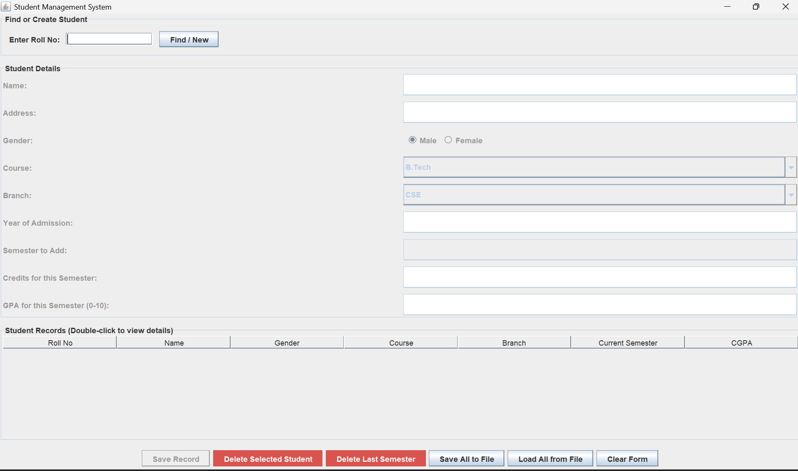
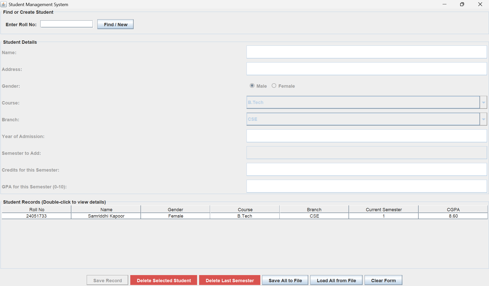
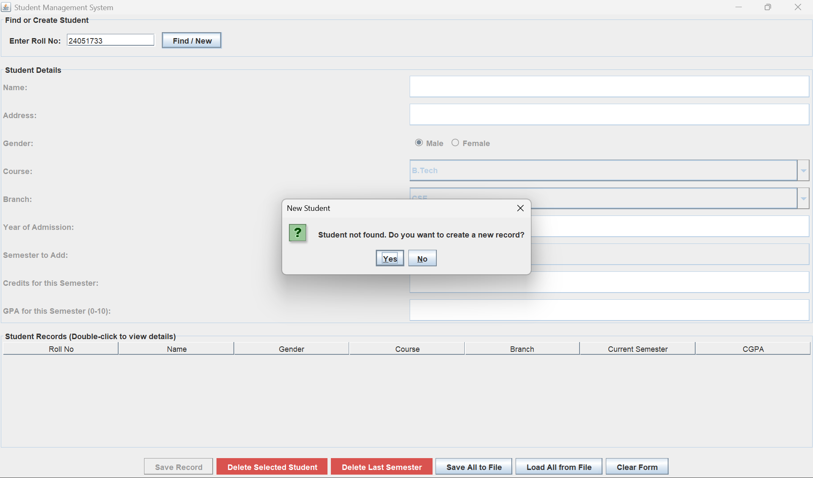
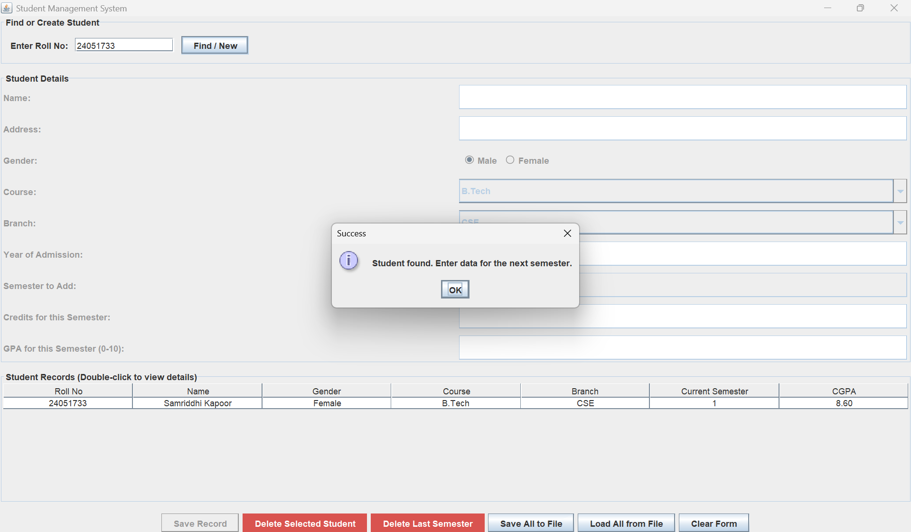
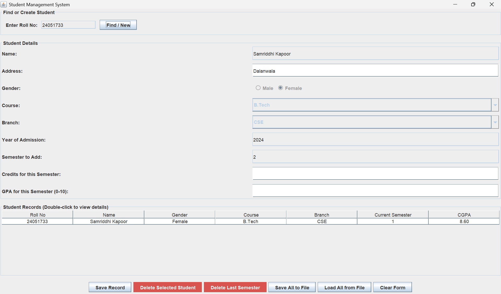
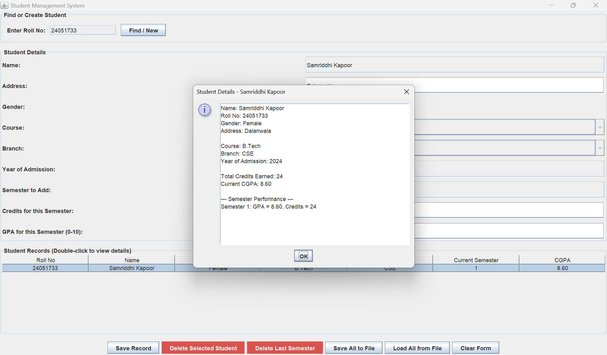

# 🎓 College CGPA Calculator

A Java-based desktop application that allows students to store semester grades and automatically calculate their overall CGPA through an interactive graphical interface.

---

## 🚀 Features

- 📊 **CGPA Calculation** – Computes overall CGPA based on semester-wise grades  
- 🧾 **Student Data Management** – Stores and retrieves student details efficiently  
- 🔁 **Auto Semester Progression** – Automatically increments semester for existing students  
- 🖥️ **Interactive GUI** – User-friendly interface built using Java Swing  
- ⚡ **Fast Data Access** – Uses HashMaps for efficient storage and retrieval  
- 🗑️ **Data Modification** – Allows deletion of student records and last semester entries  

---

## 🛠️ Tech Stack

- Java  
- Swing (GUI)  
- HashMap (Data Structures)  

---

## 🎯 Problem & Solution

**Problem:**  
Manual CGPA calculation can be time-consuming, error-prone, and difficult to manage for multiple semesters.

**Solution:**  
This application automates CGPA computation and provides an intuitive interface to manage, update, and access academic records efficiently.

---

## 📸 Screenshots

### Main Screen

  

### Data Entry

  

### New Data Input

  

### Increment Data

  

### Incremented Result

  

### CGPA Calculation

  

## 🔧 Improvements in Progress

- Enhancing UI design for better user experience  
- Adding support for multiple grading systems  
- Improving data persistence using file/database storage  

---

## 📌 How It Works

1. User enters student details (Roll No, Name, Course, etc.) and semester data  
2. Data is stored using HashMaps for efficient access and retrieval  
3. For a **new student**, records are created and CGPA is initialized  
4. For an **existing student**, previously entered details are auto-filled  
5. Semester is **automatically incremented**, and user only needs to enter new semester scores  
6. Application calculates CGPA dynamically based on all semesters  
7. Users can:
   - Delete a student record  
   - Delete the last entered semester  
   - Save and load data from file  
8. All results are displayed through an interactive GUI table  

---

## ⭐ Acknowledgment

This project demonstrates core concepts of Java programming, GUI development using Swing, data structures (HashMaps), and basic state management for real-world applications.
